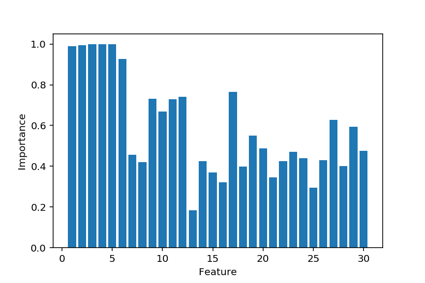

# rwfs — Random Walk Feature Selection

A quick experiment to see if its feasible to use simulated annealing for 
feature selection.  

Given an estimator, the process starts out with a random 
selection of features to use, and then for each step, a feature is toggled on or 
off at random.

If the estimator performs better with the new set of features, it is taken as
the starting point for the next step.  If it performs worse, the old set of
features is _probably_ kept, but with a small probability — depending on how
much worse it performed — the new set might still be accepted in order to 
avoid getting stuck in a local minimum.  

The probability of accepting a set of features that performed worse decreases
with each time steps (as the process "cools down") to try and make sure it
will eventually settle on a good solution.


## Installation

```shell script
pip install git+https://github.com/chrka/rwfs.git
```

## Usage

Basic usage (for an `estimator`, and a `cv` object, on a feature set `X`
with targets `y`):

```python
from rwfs import RandomWalkFeatureSelection


fs = RandomWalkFeatureSelection(estimator, cv, n_steps)
fs.fit(X, y)

X_important = fs.transform(X)
```

### Parameters

* `estimator` (object): 
        A supervised learning estimator with a ``score`` method.

* `cv` (cross-validation generator):
        Determines the cross-validation splitting strategy.

* `n_steps` (int):
        Number of steps.

* `initial_fraction` (float):
        Fraction of features to include in initial state.

* `temperature` (float):
        Initial temperature.
        
    * A higher temperature means larger probabilty of accepting a
      set of features with worse performance.  

    * The best value is dependent on the scale of the scores.

* `cooldown_factor` (float):
        Determines how fast the temperature decreases.  

    * Each time step the temperature is multiplied by this to get the new
      temperature.

* `cache_scores` (bool):
        If true, cache evaluations for feature sets.  

    * This can speed up the process considerably, but is less robust to
       scores with high variance.  Do not use unless you are very sure
       of your CV accuracy.

* `agg` (function): 
        Function to aggregate CV scores at each step.

    * Can be useful, for example, to take the min instead of the mean in
      order to to be more conservative when comparing feature sets.

* `gamma` (float):
        Exponential decay factor for feature importances.

### Attributes

* `best_score_` (float):
        CV score when evaluating best set of features found.

* `best_features_`(np.array of bool)
        Features found that resulted in the  best score.

    * Represented as an array of bool:s, True if the feature is in the set,
        False if not.

* `feature_importances` (np.array of float):
    Importance of each feature.

    * Given by the fraction of accepted feature sets a feature has been
        part of, weighted exponentially giving more weight to more recent
        steps.

* diagnostics_ (dict):
        Statistics collected during the process:

        - features : feature set being evaluated
        - feature_count : number of features in the set
        - scores : CV scores
        - score : aggregated CV score
        - mean-score : mean CV score
        - runs : number of evaluations of estimator
        - std : standard deviation of CV score
        - se : standard error of CV score

## Example

(For a more realistic example, see this
[Kaggle notebook](https://www.kaggle.com/christoffer/random-walk-feature-selection/))
using data from the [NFL Big Data Bowl](https://www.kaggle.com/c/nfl-big-data-bowl-2020)
competition

Let's set up a small example of linear regression where we have a number of
relevant features, and some that are purely noise.

```python
import numpy as np

N_OBSERVATIONS = 10000

N_RELEVANT = 6
N_NOISE = 24

# Generate non-zero coefficients
coeffs = np.random.randint(1, 10, size=N_RELEVANT)
coeffs *= np.random.choice((-1, 1), size=N_RELEVANT)


X = np.random.uniform(-10, 10, size=(N_OBSERVATIONS, N_RELEVANT + N_NOISE))
y = np.sum(X[:, :N_RELEVANT] * coeffs, axis=1)

# Add some extra noise to everything
y += np.random.normal(0, 10, size=N_OBSERVATIONS)
```

Let's use the linear regressor from scikit-learn, and then apply RWFS to the
problem:

```python
from sklearn.linear_model import LinearRegression
from sklearn.model_selection import ShuffleSplit
from rwfs import RandomWalkFeatureSelection


model = LinearRegression(fit_intercept=False)
cv = ShuffleSplit(n_splits=10, test_size=0.25)

rwfs = RandomWalkFeatureSelection(model, cv, 
                                  n_steps=1000, 
                                  initial_fraction=0.5, 
                                  temperature=1e-1,
                                  cache_scores=False,
                                  agg=np.mean,
                                  gamma=0.99)
rwfs.fit(X, y, verbose=0)
```

If we evaluate the result

```
>>> rwfs.best_score_
0.9874073607905558

>>> rwfs.best_features_
(True, True, True, True, True, True, False, False, True, False, True, False, 
True, False, False, False, False, False, False, False, False, False, True, 
False, True, False, False, False, True, True)
```

And we see that the six relevant features are all found in the best scoring
feature set, but there are also some spurious noisy ones.

Looking at the feature importances we see that we get only the relevant ones if
we make a cut at about 0.8–0.9:



## License

This software is released under the MIT license (see LICENSE).
